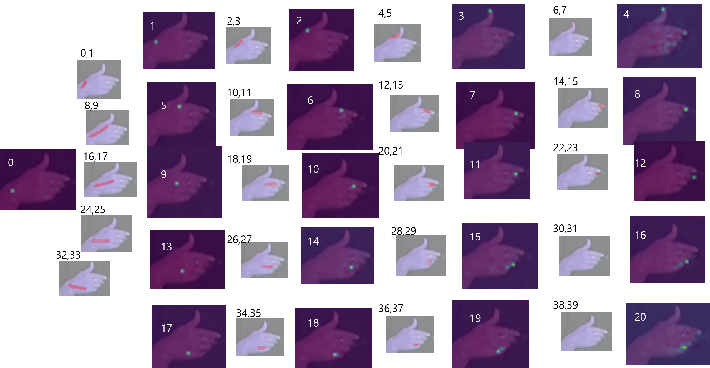

# Hand_Keypoint_Detection
reference paper : http://openaccess.thecvf.com/content_cvpr_2017/papers/Simon_Hand_Keypoint_Detection_CVPR_2017_paper.pdf

1. The Network Architecture

2. Dataset

3. Training

The upper graph is loss of confidence map, and the lower graph is loss of PAFs.

4. Output
I could get these output.
First is image with representing keypoint.

And the second is image with representing PAFs with arrows.

The Confidencemap's size is [44x44x22]. And PAFs's size is [44x44x44].
So, I could get 22 confidencemaps and 44PAFs.
Like this.

And, finally we could get these output

5. etc
